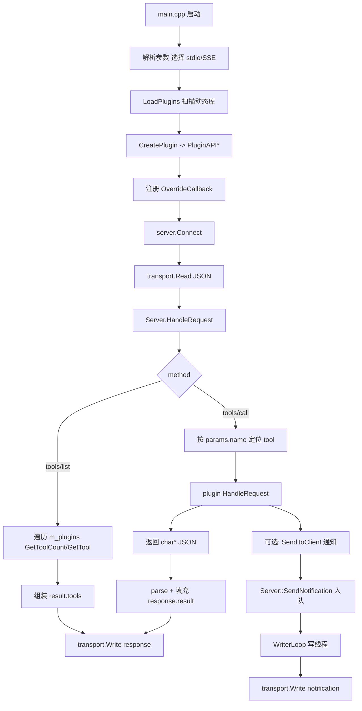
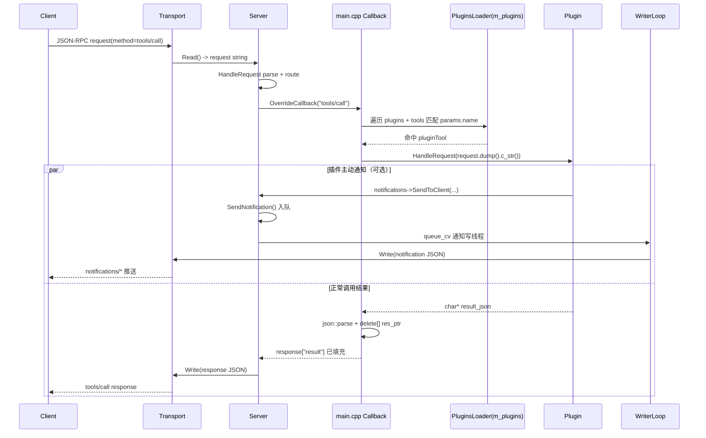
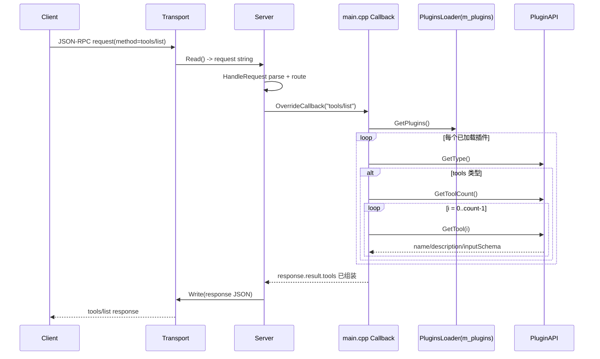

## 学习说明

这份文档系统整理 `mcp_server` 的核心代码，按“先骨架、再入口、再插件”的顺序展开，方便后续对照源码复习和面试前快速回看。

- `mcp_server/src/interface/ITransport.h`
- `mcp_server/src/server/Server.h`
- `mcp_server/src/server/Server.cpp`
- `mcp_server/src/transport/StdioTransport.h`
- `mcp_server/src/transport/StdioTransport.cpp`
- `mcp_server/src/transport/SseTransport.h`
- `mcp_server/src/utils/MCPBuilder.h`

本文不会把每一行代码都翻译一遍，而是按文件和关键函数组织内容，重点讲清楚：

- 这个文件是干什么的
- 这个函数的核心逻辑是什么
- 代码里哪些地方值得重点注意
- 哪些点适合面试时讲

## 0. 端到端全流程总览（先建立全局地图）

这一节放在最前面，是为了先把“消息怎么流动”一次看清，再按后文章节深入源码细节。

### 0.1 详细版：从启动到 `tools/list` / `tools/call`

**A. 进程启动与初始化（`main.cpp`）**

1. 解析命令行参数，选择 transport（默认 `stdio`，可切 `SSE`）。
2. 初始化 logger。
3. 创建 `PluginsLoader` 与 `Server`。
4. 调 `loader->LoadPlugins(...)` 扫描插件目录并加载动态库。
5. 给每个插件注入 `notifications->SendToClient` 回调。
6. 用 `OverrideCallback()` 注册 `tools/prompts/resources` 真实处理逻辑。
7. 调 `server->Connect(transport)`，进入 MCP 主循环。

**B. 插件加载（`PluginsLoader.*`）**

1. 遍历目录，按平台后缀筛选动态库（`.dll/.so/.dylib`）。
2. `LoadLibraryA`/`dlopen` 加载动态库拿 `handle`。
3. 按固定符号名找 `CreatePlugin` / `DestroyPlugin`。
4. 调 `CreatePlugin()` 拿到 `PluginAPI*`。
5. 调 `instance->Initialize()`。
6. 存入 `m_plugins`（`path + handle + instance + create/destroy func`）。

**C. 运行期请求处理（`Server::Connect`）**

1. `transport->Start()`（`SSE` 会真正起 HTTP 监听；`stdio` 通常是 no-op）。
2. 循环 `Read()` 读取请求 JSON 字符串。
3. `HandleRequest()` 按 `method` 路由到 `functionMap`。
4. 具体 method 逻辑由 `main.cpp` 的 `OverrideCallback()` 实现。
5. 得到响应 JSON 后 `transport->Write(...)` 回传给 client。

**D. `tools/list` 主线**

1. 遍历 `loader->GetPlugins()`。
2. 先筛 `GetType() == PLUGIN_TYPE_TOOLS`。
3. 对每个 tools 插件遍历 `GetToolCount()/GetTool(i)`。
4. 汇总 `name/description/inputSchema` 到 `response["result"]["tools"]`。

**E. `tools/call` 主线**

1. 从请求里取 `params.name`、`params.arguments`。
2. 遍历插件工具清单定位目标 tool。
3. 命中后调用 `plugin.instance->HandleRequest(request.dump().c_str())`。
4. 插件返回 `char*`（内容通常是 JSON 文本）。
5. 主程序 `json::parse(res_ptr)` 放入 `response["result"]`，然后 `delete[] res_ptr`。

**F. 通知通道（与请求响应并行）**

1. 插件可调用 `notifications->SendToClient(...)` 主动推送通知。
2. `Server::SendNotification()` 把通知入队。
3. `WriterLoop` 写线程统一 `transport->Write(...)` 发给 client。

### 0.2 面试精简版（1 分钟）

可以直接按这段讲：

“这个 `mcp_server` 是三层结构：`Transport` 负责消息进出，`Server` 负责 JSON-RPC 方法分发骨架，`PluginsLoader + PluginAPI` 负责动态插件能力。启动时 `main.cpp` 先选 `stdio/SSE`，再扫描插件目录加载动态库，找到 `CreatePlugin/DestroyPlugin` 并拿到 `PluginAPI*`。进入 `Connect` 后循环读 JSON 请求并按 `method` 分发。`tools/list` 时遍历 tools 插件返回 `name/description/inputSchema`；`tools/call` 时按 `params.name` 定位到具体工具，调用插件 `HandleRequest`，插件返回 JSON 字符串，主程序解析后包装到 JSON-RPC `result` 再回传。通知则走独立通道：插件调用 `SendToClient` 入队，由 `WriterLoop` 异步写回客户端。”

### 0.3 流程图（Mermaid）



### 0.4 时序图：`tools/call`（含通知并行通道）



### 0.5 时序图：`tools/list`



## `mcp_server` 重要文件导览

先把整个 `mcp_server` 里最重要的文件按学习顺序列出来，后面读代码时不容易乱。

| 文件 | 作用 | 建议掌握程度 |
| --- | --- | --- |
| `src/main.cpp` | 程序入口、transport 选择、插件加载、重写默认回调 | 必须掌握 |
| `src/server/Server.h` | `Server` 类定义，展示类职责和内部结构 | 必须掌握 |
| `src/server/Server.cpp` | 请求分发、同步/异步运行、通知、停机、初始化握手 | 必须掌握 |
| `src/interface/ITransport.h` | transport 抽象接口 | 必须掌握 |
| `src/transport/StdioTransport.h/.cpp` | 最简单的 transport 实现 | 必须掌握 |
| `src/transport/SseTransport.h/.cpp` | 较复杂的网络型 transport 实现 | 需要理解设计 |
| `src/utils/MCPBuilder.h` | 统一构造 MCP 响应和错误消息 | 建议掌握 |
| `src/loader/PluginsLoader.*` | 插件加载器 | 必须掌握 |
| `src/interface/PluginAPI.h` | 插件接口定义 | 必须掌握 |
| `plugins/*` | 具体插件实现 | 继续深入 |

当前这篇笔记已经覆盖 `main.cpp`、`PluginAPI`、`PluginsLoader` 三条主线，并补充了 `weather` 与 `calculator` 两个典型插件案例。

## 一、先看 `ITransport.h`：为什么 server 一上来要抽象 transport

### 1. 这个文件在整个项目里的定位

`ITransport.h` 是整个 `mcp_server` 非常基础的一层。它不是在干业务，而是在定义一个问题：

“无论消息是通过 `stdio` 传，还是通过 `SSE` 传，只要上层 `Server` 想处理 MCP 协议，它最少应该依赖哪些能力？”

这就是为什么这个文件里全是接口，没有实现。

### 2. 关键代码

```cpp
class ITransport {
public:
    virtual bool Start() = 0;
    virtual void Stop() = 0;
    virtual bool IsRunning() = 0;

    virtual std::pair<size_t, std::string> Read() = 0;
    virtual void Write(const std::string& json_data) = 0;

    virtual std::future<std::pair<size_t, std::string>> ReadAsync() = 0;
    virtual std::future<void> WriteAsync(const std::string& json_data) = 0;

    virtual std::string GetName() = 0;
    virtual std::string GetVersion() = 0;
    virtual int GetPort() = 0;
};
```

### 3. 这个接口到底规定了什么

从这段代码里可以直接看出，它要求所有 transport 都要支持三类能力。

第一类是生命周期管理：

- `Start()`
- `Stop()`
- `IsRunning()`

第二类是消息收发：

- 同步：`Read()`、`Write()`
- 异步：`ReadAsync()`、`WriteAsync()`

第三类是元信息：

- `GetName()`
- `GetVersion()`
- `GetPort()`

这意味着上层 `Server` 不关心底层究竟是读 `stdin`，还是监听 HTTP/SSE，它只关心“能不能读消息、写消息、启动、停止”。

### 4. 学这一段最该注意什么

这里有几个很容易混的知识点。

第一，`= 0` 表示纯虚函数，所以 `ITransport` 是抽象类。这不是“以后补实现”，而是“子类必须实现”。

第二，`ReadAsync()` 返回的是 `std::future`。这表示“未来某个时间点会得到读取结果”，但不等于这份代码就已经是完全事件驱动异步。

第三，transport 是“消息怎么传”的问题，而 MCP 协议版本是“消息内容按哪版规范组织”的问题，这两个层次不能混。

### 5. 这一节的学习结论

`ITransport` 是整个 server 的解耦基础。没有它，`Server` 就会被迫绑定到某一种通信方式；有了它，`Server` 才能只专注于 MCP 协议处理。

## 二、看 `StdioTransport`：最适合入门的 transport

### 1. 为什么先学 `StdioTransport`

因为它最简单。

`stdio` 模式下没有 HTTP 服务器、没有网络连接、没有复杂路由，只有两件事：

- 从标准输入读 JSON 文本
- 往标准输出写 JSON 文本

所以如果 transport 一开始就去啃 `SSE`，很容易被网络和并发细节淹没。

### 2. 头文件里最值得看的内容

```cpp
class Stdio : public vx::ITransport {
public:
    std::pair<size_t, std::string> Read() override;
    void Write(const std::string& json_data) override;

    std::future<std::pair<size_t, std::string>> ReadAsync() override;
    std::future<void> WriteAsync(const std::string& json_data) override;

    std::string GetName() override { return "stdio"; }
    std::string GetVersion() override { return "0.2"; }
    int GetPort() override { return 0; }

    bool Start() override { return true; }
    void Stop() override {}
    bool IsRunning() override { return true; }
};
```

### 3. 这段代码说明了什么

这段头文件已经说明了 `stdio` 模式的本质：

- `GetName()` 返回 `stdio`
- 没有实际网络端口，所以 `GetPort()` 是 `0`
- `Start()` 基本是空操作，直接返回 `true`
- `Stop()` 也是空实现

这和 `SSE` 很不一样。`stdio` 本身不是一个需要“启动服务器”的通信方式，它只是依赖标准输入输出流，所以这几个函数在这里更像是为了满足统一接口而存在。

### 4. `Read()` 是真正值得重点学的地方

当前我们把 `Read()` 改成了更鲁棒的版本，关键代码如下：

```cpp
std::pair<size_t, std::string> Stdio::Read() {
    while (true) {
        std::string json_data;
        int c;

        while ((c = std::getc(stdin)) != EOF && c != '\n') {
            json_data += static_cast<char>(c);
        }

        if (c == EOF) {
            if (!json_data.empty()) {
                return {json_data.length(), json_data};
            }
            return {0, ""};
        }

        if (json_data.empty()) {
            continue;
        }

        return {json_data.length(), json_data};
    }
}
```

### 5. 这个函数干了什么

这个函数的逻辑可以按四种情况理解：

第一种，正常读到一整行 JSON，然后遇到换行符 `\n`。
这时候返回这整行字符串。

第二种，只读到空行 `\n`。
这时候不返回，而是 `continue`，继续等下一条消息。

第三种，读到一段文本后遇到 EOF。
这说明输入流结束了，但当前这条消息本身是有内容的，所以先把这条消息返回。

第四种，一开始就遇到 EOF。
这时说明底层输入流真正结束，返回 `{0, ""}` 给上层，让上层把它当成连接结束。

### 6. 这里最值得注意的点

这个函数其实帮我彻底理清了“暂时没消息”和“连接断开”的区别。

- 暂时没消息时，`getc(stdin)` 会阻塞等待
- 真正断开时，才会读到 EOF

所以不能把“空返回”简单理解成“当前没消息”，空返回在这里更接近“已经没法继续读了”。

另外，空行和 EOF 必须区分开，否则 server 会把空行误判成断开，这正是我们前面修掉的问题。

### 7. `ReadAsync()` 为什么看起来还是有点同步味

```cpp
std::future<std::pair<size_t, std::string>> Stdio::ReadAsync() {
    return std::async(std::launch::async, [this]() {
        return Read();
    });
}
```

它的本质是“把同步 `Read()` 包装进一个异步任务里”，而不是从底层上彻底变成非阻塞 I/O。

这也是后面理解 `ConnectAsync()` 时非常关键的一个点：当前这套异步，更像“线程异步”，而不是“底层 I/O 完全异步”。

### 8. `Write()` 其实就是往标准输出写一行 JSON

`StdioTransport.cpp` 里的 `Write()` 很短：

```cpp
void Stdio::Write(const std::string& json_data) {
    std::cout << json_data << std::endl << std::flush;
}
```

它的含义不是“单纯打印日志”，而是：

- 把一条 JSON 消息写到当前进程的标准输出
- 用换行作为消息边界
- 立刻 `flush`，让对端尽快收到

这里最重要的理解是：`stdio` 模式下的“对端”通常不是人类终端，而是启动这个 server 的宿主程序/MCP client。宿主程序在创建子进程时会把：

- server 的 `stdin`
- server 的 `stdout`

通过管道接起来。于是：

- client 往 server 的 `stdin` 写请求
- server 往自己的 `stdout` 写响应
- client 再从这条输出管道读回 JSON

所以 `Stdio::Write()` 的 `std::cout` 在这里其实是协议输出通道。

### 9. 学完 `stdio` 最该记住什么

`stdio` transport 最值得记住的不是某一行实现细节，而是它的整体模型非常朴素：

- 不自己起网络服务
- 不维护 HTTP 路由
- 不需要单独的 server thread
- 只是借用已经存在的标准输入输出流完成消息收发

也正因为它足够简单，才特别适合作为理解 `ITransport` 的第一站。

## 三、看 `SseTransport.h`：为什么它明显比 `stdio` 复杂

### 1. 先不要逐行啃 `SSE`，先抓住角色变化

`SSE` 和 `stdio` 的最大不同，不在于“换了个通信方式”，而在于它内部自己维护了一个 HTTP 服务端。

也就是说：

- `stdio` 只是读写已有输入输出流
- `SSE` 自己还要负责监听、路由、长连接和消息队列

### 2. 头文件里的核心代码

```cpp
class SSE : public vx::ITransport {
public:
    explicit SSE(int port = 8080, std::string host = "127.0.0.1");
    ~SSE();

    std::pair<size_t, std::string> Read() override;
    void Write(const std::string& json_data) override;

    std::future<std::pair<size_t, std::string>> ReadAsync() override;
    std::future<void> WriteAsync(const std::string& json_data) override;

    bool Start() override;
    void Stop() override;
    bool IsRunning() override { return server_running_.load(); }
```

再往下看成员变量：

```cpp
std::unique_ptr<httplib::Server> server_;
std::thread server_thread_;
std::atomic<bool> server_running_ {false};
std::atomic<bool> client_connected_ {false};

std::queue<std::string> incoming_messages_;
std::queue<std::string> outgoing_messages_;
std::mutex incoming_mutex_;
std::mutex outgoing_mutex_;
std::condition_variable incoming_cv_;
std::condition_variable outgoing_cv_;
```

### 3. 这一段代码透露出的设计

这份设计说明 `SSE` 不只是“另一种读写方式”，它实际上包含了三个角色：

- HTTP 服务管理者
- SSE 长连接维护者
- 输入输出消息队列管理者

上层 `Server` 仍然只会调用 `Read()` 和 `Write()`，但在 `SSE` 内部，这两个动作已经被拆成了“入队/出队”的模型。

### 4. 配合 `SseTransport.cpp` 看运行模型

几个最重要的函数如下。

#### `Read()`

```cpp
std::pair<size_t, std::string> SSE::Read() {
    std::unique_lock<std::mutex> lock(incoming_mutex_);
    incoming_cv_.wait(lock, [this]() {
        return !incoming_messages_.empty() || !server_running_.load();
    });

    if (!server_running_.load() && incoming_messages_.empty()) {
        return {0, ""};
    }

    if (!incoming_messages_.empty()) {
        std::string message = incoming_messages_.front();
        incoming_messages_.pop();
        return { message.length(), message };
    } else {
        return {0, ""};
    }
}
```

这段的意思是：没有消息时不是忙等，而是睡眠等待；队列有消息就取出来；如果服务都停了而且队列也空了，就返回空结果。

这里最容易卡住的知识点有三个。

第一，`wait(lock, predicate)` 不是“单纯等锁释放”。它的语义是：

- 条件不满足时，自动释放锁并挂起等待
- 被唤醒后，先重新拿回锁
- 再重新检查条件
- 条件满足后才继续往下执行

所以它是在“等消息到来或停机信号”，不是在“等别人把锁释放出来”。

第二，这里一定要用 `std::unique_lock`，不能随手换成 `lock_guard`。因为条件变量 `wait()` 需要等待期间暂时解锁，再在返回前重新加锁，`lock_guard` 没有这种能力。

第三，从状态分析上看，`wait()` 返回后其实只剩三类情况：

- 队列非空、server 仍运行
- 队列非空、server 已停止
- 队列为空、server 已停止

因此末尾那个 `else { return {0, ""}; }` 更像是防御式兜底，理论上正常路径基本走不到。

#### `Write()`

```cpp
void SSE::Write(const std::string& json_data) {
    if (!client_connected_.load()) {
        return;
    }

    {
        std::lock_guard<std::mutex> lock(outgoing_mutex_);
        outgoing_messages_.push(json_data);
    }

    outgoing_cv_.notify_one();
}
```

这段告诉我们：`Write()` 并不是立刻直接把内容发到网络上，而是先把消息放到输出队列，再通知等待发送的一侧。

这里有两个很容易混淆的点。

第一，`client_connected_ == false` 时直接 `return`，并不是漏掉了“断开连接处理”。它的意思是：当前从 transport 视角看，并没有活跃的 SSE 客户端，这条消息现在没有发送对象，所以直接丢弃。真正的断连检测和状态清理是在 `HandleSSEConnection()` 的生命周期里完成的。

第二，要分清两层队列：

- `Server.cpp` 里的 `notification_queue_`：只承接协议层通知
- `SseTransport.cpp` 里的 `outgoing_messages_`：承接所有最终要通过 SSE 推给客户端的消息

所以在 `SSE` 模式下：

- 响应在 `Server` 层是“直接写 transport”
- 通知在 `Server` 层是“先入 `notification_queue_` 再写 transport”

但两者一旦进入 `SSE::Write()`，最终都会进入 `outgoing_messages_`，再由 SSE 长连接那一侧真正写出去。

#### `Start()`

```cpp
bool SSE::Start() {
    if (server_running_.load()) {
        return false;
    }

    server_running_.store(true);

    server_thread_ = std::thread([this]() {
        if (!server_->listen(host_.c_str(), port_)) {
            server_running_.store(false);
        }
    });

    std::this_thread::sleep_for(std::chrono::milliseconds(100));
    return server_running_.load();
}
```

这里能看出：`SSE` 真的会起一个后台 HTTP 服务线程，这就是为什么它的 `Start()` 和 `Stop()` 不可能像 `stdio` 一样简单。

这里还要补两个关键理解。

第一，`server_->listen(...)` 不是你项目里 `Server` 类的方法，而是 `httplib::Server` 的方法。`SseTransport` 里这个 `server_` 是一个 HTTP server 对象，不是上层 MCP 的 `vx::mcp::Server`。

第二，`listen()` 也不是“只做一次 bind/listen 就结束”的那种轻量调用。它通常内部封装了一整个 HTTP 服务循环：

- 绑定地址和端口
- 开始监听
- 接收连接
- 解析 HTTP 请求
- 分发到路由
- 持续处理，直到服务停止

所以它必须跑在一个单独的 `server_thread_` 里。否则如果当前线程直接卡进 `listen()`，上层那条基于 `Read() -> HandleRequest() -> Write()` 的 MCP 处理链就根本跑不起来。

最后那个 `sleep_for(100ms)` 不是协议要求，而是一个很简单的“给后台线程一点启动时间”的办法。它的目的只是让 `Start()` 返回前，后台线程更有机会把“监听成功/失败”的状态反映出来。

### 5. 为什么这里说“异步”，但我会觉得只是换了线程

这个项目里“异步”这个词，很容易让人误会成高性能网络编程里那种：

- 非阻塞 I/O
- 事件驱动
- 流水线式读/处理/写拆分

但当前仓库里很多 async，更接近：

- 把阻塞工作挪到后台线程
- 让调用方线程不被卡住

例如 `ConnectAsync()` 的实际模型更像：

- 主线程启动 `reader_thread_`
- `reader_thread_` 里调用 `ReadAsync()`
- `ReadAsync()` 又用 `std::async(std::launch::async, ...)` 去跑同步 `Read()`
- `reader_thread_` 再 `future.get()` 等结果
- 然后还是 `reader_thread_` 自己处理请求、自己写响应

所以它带来的主要变化是“谁被阻塞”，而不是“请求链路被真正拆成多个完全独立的异步阶段”。也正因为这样，这份代码会让人觉得“异步了，但又没有完全异步化”。

### 6. `SetupRoutes()`：这个 HTTP server 实际上只有哪几个入口

`SSE` 模式下的 HTTP server 路由非常少，核心只有四类：

- `OPTIONS /.*`
- `GET /health`
- `POST /messages`
- `GET /sse`

这里必须分清：

- HTTP 路由层：只有这几个 URL 入口
- MCP 方法层：`tools/list`、`tools/call`、`prompts/get` 这些都不是 HTTP 路由，而是后续 JSON 请求里的 `method`

也就是说，当前 `SSE` transport 不是把每个 MCP 方法都映射成一个 HTTP 路由，而是：

- 用 `/messages` 统一承载客户端发来的 JSON 请求
- 再由上层 `Server` 去按 `method` 分发

### 7. `OPTIONS` 和 CORS 到底在解决什么问题

这是 `SSE` 里最容易混的前端/浏览器知识点。

如果一个网页来源是：

```txt
http://localhost:3000
```

而它去访问：

```txt
http://127.0.0.1:8080
```

浏览器会认为这不是同源请求，因为：

- host 不同：`localhost` vs `127.0.0.1`
- 端口不同：`3000` vs `8080`

只要协议、主机名、端口三者里有任何一个不同，浏览器就认为是跨域。

这时浏览器往往会先发一个 `OPTIONS` 预检请求，去问服务端：

- 允不允许跨域
- 允不允许 `GET/POST/OPTIONS`
- 允不允许带 `Content-Type`、`Authorization` 等请求头

所以：

- `HandleOptionsRequest(...)` 负责回答这类“预检问题”
- `SetCORSHeaders(res)` 负责给响应统一加上 CORS 相关标准头

这些 header 名字不是随便发明的，而是浏览器按 CORS 规范检查的标准字段，例如：

- `Access-Control-Allow-Origin`
- `Access-Control-Allow-Methods`
- `Access-Control-Allow-Headers`

如果服务端没有正确返回这些头，常见情况不是“网络层完全收不到响应”，而是：

- 浏览器其实收到了 HTTP 响应
- 但浏览器安全策略不允许页面里的 JS 访问它

所以从前端视角看，会像“被浏览器拦住了”。

### 8. `HandleSSEConnection()`：真正的 SSE 长连接核心

如果只用一句话概括这个函数，我会这样记：

“当客户端访问 `GET /sse` 时，把普通 HTTP 响应升级成一个持续输出的 SSE 事件流。”

这个函数内部最值得记住的动作有这些：

第一，记录请求元信息。这里打印的：

- `req.method`
- `req.path`
- `req.version`
- `req.remote_addr`
- `req.remote_port`

都不是请求头，而是请求行信息和底层连接元信息。真正的请求头在 `req.headers` 里。

第二，设置 SSE 响应头：

- `Content-Type: text/event-stream`
- `Cache-Control: no-cache`
- `Connection: keep-alive`

第三，调用 `res.set_content_provider(...)`，注册一个持续向客户端写流的回调。这里的 `sink` 可以理解成“当前这条 SSE 长连接对应的输出口”，并不是协议要求一定叫这个名字，而是 `cpp-httplib` 给你的流式写接口。

第四，首次连接时先发送一个 `event: endpoint` 消息，告诉客户端后续往哪个 `/messages?session_id=...` 端点发普通消息。

第五，周期性发送 `: ping\n\n` 作为 keep-alive。这里的 `ping` 不是系统命令，而是 SSE 流里的心跳注释行。它的作用有两个：

- 保持长连接活跃
- 更早发现客户端已经断开

这里的 `ping_interval = 15s` 可以把它理解成“基于时间差实现的简易定时逻辑”。

第六，等待 `outgoing_messages_` 队列里有没有新消息：

```cpp
outgoing_cv_.wait_for(lock, std::chrono::milliseconds(200), ...)
```

它等的就是“有没有人往 outgoing 队列里 push 新消息并通知条件变量”。这通常发生在 `SSE::Write()` 被调用之后。

第七，如果队列里有消息，就把它包装成：

```txt
data: <message>\n\n
```

再通过 `sink.write(...)` 真正发给客户端。

### 9. 为什么 `HandlePostMessage()` 里读的是 `req.body`

`POST /messages` 对应的是客户端往 server 发消息的入口。

这里的：

```cpp
std::string message = req.body;
```

表示取出 HTTP 请求体 body 里的内容。

一定要分清：

- `req.headers`：请求头
- `req.method / req.path / req.version`：请求行信息
- `req.body`：真正的请求正文

在这个接口里，客户端提交的那条 MCP JSON 消息就是放在 body 里的，而不是放在 header 里。取出 body 后，它会被 push 到 `incoming_messages_`，再由 `SSE::Read()` 交给上层 `Server` 消费。

### 10. 这一节的学习重点

学习 `SSE` 不用强求把每个路由实现都记住，但一定要理解：

- 为什么它需要自己的 `server_thread_`
- 为什么输入输出都要走队列
- 为什么它内部其实有“HTTP 路由层”和“MCP method 层”两层分发
- 为什么 `OPTIONS + CORS` 是浏览器访问时绕不过去的一层
- 为什么 `HandleSSEConnection()` 才是真正的推流核心
- 为什么它仍然能对上层暴露统一的 `Read()` / `Write()` 接口

这就是 transport 抽象真正发挥价值的地方。

## 四、看 `Server.h`：先把类的结构图搭起来

### 1. 为什么头文件值得认真读

很多时候头文件比实现更适合入门，因为它会先告诉你这个类“打算做什么”。`Server.h` 就非常适合拿来搭结构图。

### 2. 类的核心公开接口

```cpp
bool Connect(const std::shared_ptr<ITransport>& transport);
bool ConnectAsync(const std::shared_ptr<ITransport> &transport);

void Stop();
void StopAsync();

inline bool IsValid() { return transport_ != nullptr; }
inline void VerboseLevel(int level) { verboseLevel_ = level; }
inline void Name(const std::string& name) { name_ = name; }

bool OverrideCallback(const std::string &method, std::function<json(const json&)> function);
void SendNotification(const std::string& pluginName, const char* notification);
```

### 3. 这一组接口说明了什么

从功能角度可以把它们分成四组：

第一组，生命周期：

- `Connect`
- `ConnectAsync`
- `Stop`
- `StopAsync`

第二组，简单配置：

- `IsValid`
- `VerboseLevel`
- `Name`

第三组，协议扩展：

- `OverrideCallback`

第四组，主动通知：

- `SendNotification`

这说明 `Server` 不是单纯的 JSON 处理类，而是一个完整的“协议运行核心”。

### 4. 内部成员最值得看的地方

```cpp
std::unordered_map<std::string, std::function<json(const json&)>> functionMap;

std::atomic<bool> isStopping_{false};
std::atomic<bool> isSyncCleaned_{false};
std::atomic<bool> isAsyncCleaned_{false};
int verboseLevel_ = 0;
int parserErrors_ = 0;
std::string name_ = "mcp-server";

std::shared_ptr<ITransport> transport_;
std::queue<std::string> notification_queue_;
std::mutex output_mutex_;
std::condition_variable queue_cv_;
std::thread writer_thread_;
std::atomic<bool> writer_running_{false};
std::thread reader_thread_;
std::atomic<bool> reader_running_ = false;
```

### 5. 这里该怎么理解

这一段其实已经把整个 `Server` 的运行模型暴露出来了：

- `functionMap` 负责 method 路由
- `transport_` 是底层通信抽象
- `notification_queue_` 负责承接待发送通知
- `writer_thread_` 是通知写线程
- `reader_thread_` 是异步模式下的读线程
- `isStopping_` 是“通知大家准备停机”的广播状态
- `isSyncCleaned_` / `isAsyncCleaned_` 是“真正清理动作是否已经做过”的一次性门闩

读到这里时我最大的感受是：`Server` 不是一个轻量工具类，而是一个带并发和生命周期管理的核心组件。

这里我后来又补明白了一个很关键的点：`停止` 和 `清理` 不是一回事。

- `isStopping_ = true` 更像是在广播：“别再继续处理请求和发通知了，准备收工。”
- `isSyncCleaned_` / `isAsyncCleaned_` 更像是在判断：“真正的收尾动作是不是已经有人做过了？”

为什么要分开？因为 `Stop()` 里不只是改一个标志，它还会：

- 调 `transport_->Stop()`
- `transport_.reset()`
- `join()` 写线程
- `join()` 读线程

这些动作天然都更适合只做一次。否则一旦 `Connect()` 退出路径、外部 `Ctrl+C` 处理路径、析构路径前后脚都进 `Stop()`，就可能变成重复清理同一批资源。

### 6. 这里需要特别注意的点

`Capabilities` 这个枚举当前写成了：

```cpp
enum Capabilities {
    RESOURCES = 0 << 1,
    TOOLS = 0 << 2,
    PROMPTS = 0 << 3,
};
```

这个定义看起来很可疑，因为 `0 << anything` 结果都是 `0`。我当前的结论是：这里更像作者原本想表达能力位标志，但这段定义本身并不合理，至少目前不适合死背。

## 五、看 `Server.cpp`：真正的骨架都在这里

这部分是当前学习的重点，也是最容易被“默认壳子函数”干扰的地方。正确的看法不是把整份 `Server.cpp` 平铺看完，而是先抓最核心的骨架函数。

### 1. `Server::Server()`：先把路由表建立起来

关键代码：

```cpp
Server::Server() {
    functionMap = {
        {"initialize", [this](const json& req) { return this->InitializeCmd(req); }},
        {"ping", [this](const json& req) { return this->PingCmd(req); }},
        {"resources/list", [this](const json& req) { return this->ResourcesListCmd(req); }},
        {"resources/read", [this](const json& req) { return this->ResourcesReadCmd(req); }},
        {"tools/list", [this](const json& req) { return this->ToolsListCmd(req); }},
        {"tools/call", [this](const json& req) { return this->ToolsCallCmd(req); }},
        {"prompts/list", [this](const json& req) { return this->PromptsListCmd(req); }},
        {"prompts/get", [this](const json& req) { return this->PromptsGetCmd(req); }},
        ...
    };
}
```

### 2. 这个函数到底在干什么

它就是在做一件事：把 MCP 的方法名和对应处理函数绑起来。

以后只要 `HandleRequest()` 拿到一个 `method`，比如：

- `initialize`
- `tools/list`
- `prompts/get`

就可以去 `functionMap` 里找到对应处理函数。

### 3. 这里值得注意的知识点

这一段里有两个现代 C++ 关键语法点：

第一，`std::function<json(const json&)>` 用来统一包装“可调用对象”。

第二，这里存进去的不是普通函数指针，而是 lambda：

```cpp
[this](const json& req) { return this->InitializeCmd(req); }
```

也就是说，路由表里存的不是方法名字符串，而是“真正可以被调用的处理逻辑”。

### 4. 学完这一节应该知道什么

`Server` 的本质不是 if-else 大杂烩，而是一个**基于路由表的请求分发器**。

### 5. `HandleRequest()`：整个 server 的分发中枢

关键代码：

```cpp
json Server::HandleRequest(const json &request) {
    if (!request.contains("method")) {
        return MCPBuilder::Error(MCPBuilder::InvalidRequest, request["id"], "Missing method");
    }

    std::string methodName = request["method"];
    auto it = functionMap.find(methodName);
    if (it != functionMap.end()) {
        json response = it->second(request);
        return response;
    }

    int id = request["id"];
    return MCPBuilder::Error(MCPBuilder::MethodNotFound, std::to_string(id), "Method not found");
}
```

### 6. 这个函数做了什么

可以直接按 4 步记：

1. 检查请求里是否有 `method`
2. 读取 `methodName`
3. 去 `functionMap` 里查找
4. 找到就执行，找不到就返回 `MethodNotFound`

### 7. 为什么这里用 `find()` 而不是 `count() + []`

这是一个很典型的 C++ 容器习惯用法。

- `find()` 一次查找就拿到迭代器
- `count() + operator[]` 可能需要两次查找
- `operator[]` 在 key 不存在时还有插入默认值的副作用

所以这里的写法更标准，也更安全。

### 8. 学这一节最该掌握的点

`HandleRequest()` 不关心某个 tool 具体怎么执行，它只负责“路由”和“错误兜底”。

## 六、看 `Connect()`：同步版主循环到底怎么跑

### 1. 关键代码

```cpp
bool Server::Connect(const std::shared_ptr<ITransport> &transport) {
    transport_ = transport;
    isStopping_ = false;
    isSyncCleaned_ = false;

    writer_running_ = true;
    writer_thread_ = std::thread(&Server::WriterLoop, this);

    if (!transport_->Start()) {
        return false;
    }

    while (!isStopping_) {
        auto [length, json_string] = transport->Read();
        if (isStopping_) break;

        if (length == 0 && json_string.empty()) {
            isStopping_ = true;
            break;
        }

        try {
            if (json_string.empty()) continue;
            json request = json::parse(json_string);
            parserErrors_ = 0;
            json response = HandleRequest(request);
            if (response != nullptr) {
                std::lock_guard<std::mutex> lock(output_mutex_);
                transport_->Write(response.dump());
            }
        } catch (json::parse_error &e) {
            if (++parserErrors_ > MAX_PARSER_ERRORS) return false;
        }
    }

    Stop();
    return true;
}
```

### 2. 这个函数干了什么

同步版 `Connect()` 可以理解成一个完整的 server 主循环：

第一步，保存 `transport_` 并重置 `isStopping_`。现在还会顺手把 `isSyncCleaned_` 重置为 `false`，表示这轮新的运行周期还没有做过同步清理。

第二步，先起一个 `writer_thread_`，它不负责读请求，而是负责发送 notification。

第三步，启动 transport。对于 `SSE` 来说会真正起 HTTP 服务，对于 `stdio` 来说就是一个空操作。

第四步，主线程开始阻塞读请求：

- `Read()`
- `json::parse`
- `HandleRequest()`
- `Write()`

最后，当循环退出时，统一调用 `Stop()`。

### 3. 这里最值得注意的几个点

第一个点，同步版没有独立 reader 线程。主线程自己负责读取请求。

第二个点，`Read()` 返回 `{0, ""}` 会被视为连接结束信号。

第三个点，写响应前要加 `output_mutex_`，因为此时还有一个通知写线程也可能写 transport。

第四个点，`json::parse_error` 超过阈值时目前直接 `return false`，这会绕过函数尾部的 `Stop()`。这条错误路径从设计上还有优化空间。

### 4. 这一节学习后的结论

同步版 `Connect()` 才是当前主程序真正使用的主流程，也是整个 server 最核心的运行入口。

## 七、看 `WriterLoop()` 和 `SendNotification()`：为什么通知要单独走一条线

### 1. `SendNotification()`：先入队，再唤醒写线程

关键代码：

```cpp
void Server::SendNotification(const std::string& pluginName, const char* notification) {
    if (isStopping_) {
        LOG(WARNING) << pluginName << " attempted to send notification while server stopping." << std::endl;
        return;
    }

    {
        std::lock_guard<std::mutex> lock(output_mutex_);
        notification_queue_.emplace(notification);
    }
    queue_cv_.notify_one();
}
```

### 2. 这个函数干了什么

它不是直接写 transport，而是先把通知压进队列，再通过 `notify_one()` 把写线程叫醒。

这里日志里带 `pluginName` 不是因为一个 plugin 对应一个 server，而是为了排查“停机阶段是谁还在尝试发通知”。

### 3. `WriterLoop()`：真正负责把通知写出去

关键代码：

```cpp
void Server::WriterLoop() {
    while (writer_running_.load()) {
        std::string notification_to_send;
        {
            std::unique_lock<std::mutex> lock(output_mutex_);
            queue_cv_.wait(lock, [this] { return !notification_queue_.empty() || !writer_running_.load(); });

            if (!writer_running_.load() && notification_queue_.empty()) {
                break;
            }

            if (!notification_queue_.empty()) {
                notification_to_send = std::move(notification_queue_.front());
                notification_queue_.pop();
            }
        }

        if (!notification_to_send.empty() && transport_) {
            std::lock_guard<std::mutex> write_lock(output_mutex_);
            if (transport_) {
                transport_->Write(notification_to_send);
            }
        }
    }
}
```

### 4. 为什么这里要单独开线程

因为通知不是“收到请求后立刻回应”的那种模式，它可能在任意时刻由插件主动触发。

如果不单独抽线程，你就要么：

- 到处直接 `transport_->Write()`
- 要么把通知发送硬塞进主循环

现在这种设计的好处是：

- 普通响应仍然由主线程写
- 通知统一由 `WriterLoop()` 写
- 真正写 transport 时再用同一把 `output_mutex_` 做互斥

这就避免了多个地方无序地同时写 transport。

### 5. 这段代码里最值得注意的并发知识

第一个知识点是 `condition_variable::wait(lock, predicate)`。它本质上已经等价于“带 while 的等待模式”，所以不需要你手工再套一层 `while`。

第二个知识点是 `unique_lock`。这里不能用 `lock_guard`，因为 `wait()` 需要在内部自动解锁和重新加锁。

第三个知识点是那层额外的 `{}`。它不是多余，而是为了让锁作用域更小，在真正写 transport 之前先释放队列相关锁。

## 八、看 `Stop()`：server 是怎么优雅停机的

### 1. 关键代码

```cpp
void Server::Stop() {
    if (isSyncCleaned_.exchange(true)) return;

    isStopping_ = true;

    if (transport_) {
        transport_->Stop();
        transport_.reset();
    }

    writer_running_ = false;
    queue_cv_.notify_one();
    if (writer_thread_.joinable()) {
        writer_thread_.join();
    }

    reader_running_ = false;
    if (reader_thread_.joinable()) {
        reader_thread_.join();
    }
}
```

### 2. 这个函数干了什么

停机过程可以分成五步：

第一步，先通过 `isSyncCleaned_.exchange(true)` 抢一次“清理执行权”。

这里的 `exchange(true)` 我现在会专门单独记一下，因为它很容易一眼看过去却没真正理解透。它做了两件事，而且这两件事是原子完成的：

- 先把 `isSyncCleaned_` 设为 `true`
- 再返回修改前的旧值

所以这句：

```cpp
if (isSyncCleaned_.exchange(true)) return;
```

可以按两种情况理解：

- 如果返回的旧值是 `true`，说明之前已经有人把它设成过 `true`，也就意味着清理逻辑已经执行过了，所以当前这次调用直接 `return`
- 如果返回的旧值是 `false`，说明当前这次调用是第一个把它改成 `true` 的，于是继续往下执行真正的清理逻辑

也就是说，它不是普通的“先判断，再赋值”，而是把“设为 `true`”和“取旧值”合成了一个不可分割的操作。这样多个停止路径即使前后脚进入 `Stop()`，也只有第一个进入的人会拿到旧值 `false`，从而继续清理；后面的路径都会拿到 `true` 并直接返回。

第二步，设置全局停止标志 `isStopping_ = true`，告诉主循环、通知发送等路径都准备退出。

第三步，停止 transport。对于 `SSE` 来说是真正停 HTTP 服务；对于 `stdio` 来说基本是 no-op。

第四步，通知 writer 线程退出，并 `join()` 它。

第五步，如果存在 reader 线程，也把它回收掉。

### 3. 为什么 `Stop()` 后还要 `transport_.reset()`

因为 `Stop()` 只是“让底层不再运行”，`reset()` 则表示“当前 server 不再持有这个 transport 对象”，属于资源释放层面的收口。

我现在更愿意把这里理解成两层动作：

- `isStopping_` 是停机广播
- `transport_.reset()`、`join()` 等是资源清理

这也是为什么上游后来又加了 `isSyncCleaned_` / `isAsyncCleaned_`。他们想解决的不是“把 `isStopping_` 设成 `true` 会不会重复”，而是“这些一次性清理动作会不会被重复执行”。

### 4. `joinable()` 和 `join()` 到底是什么意思

- `joinable()`：这个 `std::thread` 对象当前是否还关联着一个可以 `join` 的真实线程
- `join()`：当前线程在这里等待，直到那个线程真正结束并回收线程资源

注意，`join()` 不是“把线程杀掉”。真正让线程退出的是：

- 改运行标志
- 唤醒条件变量
- 线程自己跳出循环

`join()` 只是等待它优雅结束。

### 5. 为什么这里会有“重复清理”的风险

我一开始也以为这里线程不多，同步模式下主要还是主线程在跑，不太像典型的多线程抢锁问题。后来想明白之后，发现关键不是“线程有多少”，而是“`Stop()` 有几个入口”。

当前至少能看到这些路径都可能进 `Stop()`：

- `Connect()` 主循环退出后的收尾路径
- `main.cpp` 里的 `Ctrl+C` 停止处理路径
- `Server` 析构路径

所以风险更准确地说是：

- 不一定是很多线程同时一起 `Stop()`
- 更像是多个执行路径前后脚进入 `Stop()`
- 然后重复执行 `transport_->Stop()`、`reset()`、`join()` 这些本该只做一次的动作

也正因为这样，`exchange(true)` 这一层保护才显得很有必要。它本质上就是在 `Stop()` 前面加了一个门闩：第一个进来的人负责真正清理，后面再进来的路径直接返回。

## 九、看 `ConnectAsync()`：为什么它看起来有点“异步但又不完全异步”

### 1. 关键代码

```cpp
reader_running_ = true;
reader_thread_ = std::thread([this]() {
    while (reader_running_ && !isStopping_) {
        try {
            auto future = transport_->ReadAsync();
            auto [length, json_string] = future.get();

            if (isStopping_ || (length == 0 && json_string.empty())) {
                break;
            }

            if (!json_string.empty()) {
                json request = json::parse(json_string);
                parserErrors_ = 0;
                json response = HandleRequest(request);
                if (response != nullptr) {
                    std::lock_guard<std::mutex> lock(output_mutex_);
                    transport_->Write(response.dump());
                }
            }
        } catch (...) {
            ...
        }
        std::this_thread::sleep_for(std::chrono::milliseconds(1));
    }
});
```

### 2. 为什么它让我觉得“有点奇怪”

因为它虽然叫 `ConnectAsync()`，也确实起了一个 `reader_thread_`，但 reader 线程内部又是：

- `ReadAsync()`
- 紧接着 `future.get()`

这意味着对这个 reader 线程来说，它仍然是在等待结果。

所以更准确的说法是：

- 它实现了“对调用者异步”
- 但没有做到“底层 I/O 完全事件驱动异步”

### 3. 当前对它的学习结论

我当前把这部分先理解为：

- 它在思路上是“把读请求这件事搬到后台线程”
- 但实现上还不够打磨
- 当前项目主程序也没有使用它，所以不需要把它当成主线深挖

它更适合作为“可讨论的扩展设计”和“值得质疑的实现点”来记。

## 十、看 `InitializeCmd()`：MCP 握手到底在干什么

### 1. 关键代码

```cpp
json Server::InitializeCmd(const json &request) {
    if (request.contains("params")) {
        json params = request["params"];
        if (params.contains("rootUri")) { ... }
        if (params.contains("rootPath")) { ... }
        if (params.contains("initializationOptions")) { ... }
        if (params.contains("capabilities")) { ... }
        if (params.contains("trace")) { ... }
        if (params.contains("workspaceFolders")) { ... }
    }

    nlohmann::ordered_json response = {};
    response["jsonrpc"] = "2.0";
    response["id"] = request["id"];
    response["result"]["protocolVersion"] = request["params"]["protocolVersion"];
    response["result"]["capabilities"]["tools"] = json::object();
    response["result"]["capabilities"]["prompts"] = json::object();
    response["result"]["capabilities"]["resources"]["subscribe"] = true;
    response["result"]["capabilities"]["logging"] = json::object();
    response["result"]["serverInfo"]["name"] = name_;
    response["result"]["serverInfo"]["version"] = PROJECT_VERSION;
    return response;
}
```

### 2. 这个函数到底是干什么的

它处理的不是工具调用，而是 MCP 初始化握手。

更直白一点说，客户端在刚连接上 server 时，会先发一个 `initialize` 请求。这个函数就是在回答两个问题：

- 客户端给了我哪些初始化信息
- 我这个 server 支持哪些能力、叫什么名字、用什么协议版本

### 3. 最值得记住的几个字段

`protocolVersion`

- 表示 MCP 协议版本
- 不是 `stdio` 或 `SSE` 的版本
- 当前仓库测试里常见的例子是 `2024-11-05`

`rootUri`

- 表示工作区根 URI
- 不是普通 path
- 更适合跨平台和统一资源表示

`capabilities`

- 表示客户端能力声明
- 当前代码主要是读取并打印日志

### 4. 为什么这里 `tools`、`prompts` 返回的是 `json::object()`

因为这里不是在返回具体列表，而是在声明“我支持这类能力”。

比如：

```cpp
response["result"]["capabilities"]["tools"] = json::object();
```

它的含义不是“我这里有一堆 tool”，而是：

“我支持 tools 这一类能力，当前先用一个空对象作为能力节点。”

如果想拿到具体有哪些 tool，应该再发 `tools/list` 请求。

## 十一、看 `MCPBuilder.h`：它为什么很适合拿来做辅助理解

### 1. 关键代码

```cpp
static json Response(json request) {
    json response;
    response["jsonrpc"] = "2.0";
    response["id"] = request["id"];
    response["result"] = json::object();
    return response;
}

static json Error(ErrorCode code, const std::string& id, const std::string &message) {
    return {
        {"jsonrpc", "2.0"},
        {"error", {{"code", code}, {"message", message}}},
        {"id", id}
    };
}
```

### 2. 这个工具类有什么价值

它把很多重复的 JSON 拼装逻辑统一了。

比如：

- 生成标准响应骨架
- 生成标准错误响应
- 生成文本、图片、音频内容块
- 生成日志通知和进度通知

所以当后面继续学 `main.cpp` 和插件时，只要看到 `MCPBuilder::Response()`，就能很快知道它是在构造标准 MCP 响应。

## 十二、对 `Server.cpp` 的整体判断

我现在对 `Server.cpp` 的看法是：

前半部分是核心，必须认真看：

- 路由表
- `HandleRequest()`
- `Connect()`
- `WriterLoop()`
- `Stop()`
- `InitializeCmd()`

后半部分有不少 `xxxCmd()` 在当前项目里更像默认壳子，尤其是：

- `ToolsListCmd()`
- `ToolsCallCmd()`
- `PromptsListCmd()`
- `ResourcesListCmd()`

因为当前项目真正运行时，这些逻辑主要会在 `main.cpp` 里被 `OverrideCallback()` 接管。

所以不能简单说“整个 `Server.cpp` 都是壳子”，但可以说：

“真正值得精读的是前半部分骨架，后半部分很多默认命令实现只需要知道定位即可。”

## 十三、看 `main.cpp`：程序入口怎么把整套系统串起来

### 1. 为什么 `main.cpp` 很重要

前面学 `Server.cpp` 时，更像是在看“协议处理骨架”。而 `main.cpp` 负责的，是把这些骨架真正接起来：

- 解析启动参数
- 选择 `stdio` 或 `sse`
- 初始化日志
- 加载插件
- 把插件能力接入 `Server`
- 启动主循环

所以 `main.cpp` 不是简单入口，它是整个程序的组装中心。

### 2. 程序入口的主线流程

结合当前代码，我建议把 `main.cpp` 按下面 8 步记忆：

1. 定义全局 `server` 指针和通知相关状态
2. 注册 `SIGINT` 处理函数，支持 `Ctrl+C` 停服
3. 配置并解析命令行参数
4. 根据参数选择 `Stdio` 或 `SSE` transport
5. 初始化日志系统
6. 加载插件，并为插件接上通知回调
7. 通过 `OverrideCallback()` 把 `tools/prompts/resources` 的真实逻辑注册到 `Server`
8. 调用 `server->Connect(transport)` 进入主循环

如果面试时要用一句话讲 `main.cpp`，可以说：

“`main.cpp` 的职责不是处理协议细节，而是完成 server、transport、plugin、logger 这四大模块的组装和启动。”

补一个非常容易误会的顺序点：

- 插件加载发生在 `Connect` 之前
- `tools/list` 只是读取已加载插件的工具元信息，不负责触发插件加载

所以这条链路不是“先 list 再加载插件”，而是“先加载插件再对外提供 list/call 能力”。

### 3. 为什么 `server` 用的是全局 `std::shared_ptr`

代码里一上来有这一句：

```cpp
std::shared_ptr<vx::mcp::Server> server;
```

这个点我一开始也容易误会。它的含义不是“已经创建了一个 `Server` 对象”，而是：

- 定义了一个智能指针变量 `server`
- 这个指针一开始是空的
- 真正创建对象是在后面：

```cpp
server = std::make_shared<vx::mcp::Server>();
```

为什么不直接用局部对象？

因为下面两个全局函数都要访问它：

- `stop_handler()`：处理 `Ctrl+C`
- `ClientNotificationCallbackImpl()`：处理插件主动发来的 notification

也就是说，这里用全局智能指针，核心目的不是“炫技”，而是：

- 让全局回调函数也能访问 `Server`
- 生命周期由智能指针管理
- 判空方便

从当前代码看，`shared_ptr` 不是唯一选择，`unique_ptr` 理论上也能做；但作者这里用了更宽松的共享语义。

### 4. `signal(SIGINT, stop_handler)` 是什么

这一句：

```cpp
signal(SIGINT, stop_handler);
```

表示：

- 当程序收到 `SIGINT`
- 就调用 `stop_handler`

最常见的 `SIGINT` 来源就是按 `Ctrl+C`。

这里的 `signal` 不是项目自己实现的，而是标准库/运行库提供的函数，来自：

```cpp
#include <csignal>
```

它的作用就是给程序注册信号处理函数，实现“优雅退出”。

### 5. 命令行参数这一段到底在做什么

这一段的主线是：

- `OptionParser op("Allowed options");`：创建解析器
- `op.add<Switch>(...)`：注册开关参数
- `op.add<Value<T>>(...)`：注册带值参数
- `assign_to(...)`：把解析结果绑定到变量
- `op.parse(argc, argv);`：真正解析用户启动命令

这里最容易混的是 `Switch` 和 `Value<T>`。

`Switch` 表示“只看有没有出现”的开关，例如：

- `--help`
- `--sse`

`Value<T>` 表示“参数后面还要跟一个值”，例如：

- `--name demo`
- `--plugins ./plugins`

所以 `main.cpp` 当前的 transport 选择逻辑其实很简单：

- 默认走 `stdio`
- 只有命令行显式传了 `-s` 或 `--sse`，才切到 `SSE`

### 6. transport 和 tool 来源不是一回事

这是整条主线里非常容易混的点。

`stdio` / `sse` 决定的是：

- 客户端怎么连到这个 `mcp_server`
- 消息是怎么进出的

它不决定：

- tool 是本地的还是网络的
- plugin 内部具体怎么实现业务

所以正确理解应该是：

- 一个 `Server` 一次运行只绑定一种 transport
- 但这个 `Server` 下面的 plugin 仍然可以同时提供本地和网络两类能力

### 7. logger 初始化这一段该怎么理解

日志初始化部分看起来有点碎，其实主线非常简单：

1. 取当前时间
2. 格式化出一个适合当文件名的时间字符串
3. 拼出日志路径
4. 创建文件 sink
5. 初始化 `AixLog`

这里的 `sink` 可以理解成“日志输出目标”。

当前代码用了：

```cpp
auto sink_file = std::make_shared<AixLog::SinkFile>(AixLog::Severity::trace, logFilename);
AixLog::Log::init({sink_file});
```

它的含义是：

- 创建一个文件型日志接收器
- 然后把它注册给整个日志系统

如果以后传入多个 sink，就表示：

- 同一条日志可以同时发往多个地方
- 例如终端 + 文件

### 8. 为什么通知系统要包成 `NotificationSystem`

`main.cpp` 里这段代码：

```cpp
for (auto& plugin : loader->GetPlugins()) {
    plugin.instance->notifications = new NotificationSystem();
    plugin.instance->notifications->SendToClient = ClientNotificationCallbackImpl;
}
```

它是在给每个插件接上“反向通知客户端”的通道。

这里作者没有让 plugin 直接依赖 `Server`，而是给插件一小块“通知能力接口”：

- plugin 只知道自己有个 `notifications`
- 里面有个 `SendToClient`
- 真正发给 MCP client 的逻辑由主程序接上

从当前结构看，这个 `NotificationSystem` 只有一个回调成员，确实有一点“为了未来扩展提前包一层”的味道。就当前复杂度来说，直接把 `SendToClient` 放进 `PluginAPI` 也能工作。

再加一个实践层面的关键结论：

- 只有插件主动调用 `notifications->SendToClient(...)`，才会真的有通知发出
- 主程序只是“注入回调 + 负责发送”，不会替插件自动生成通知
- 当前 `notification` 插件更偏演示：在一次 `tools/call` 的处理期间连续发 progress/log 通知

也就是说，它已经体现了“请求响应通道”和“通知通道”分离，但“无请求自动推送”的业务例子目前仓库里还没有现成实现。

### 9. 为什么真实业务逻辑是通过 `OverrideCallback()` 接进来的

`Server.cpp` 里自带了一套默认命令实现，但当前项目真正运行时，用的是 `main.cpp` 注册进去的重写版本，比如：

- `tools/list`
- `tools/call`
- `prompts/list`
- `prompts/get`
- `resources/list`
- `resources/read`

`OverrideCallback()` 的函数签名本质上是：

```cpp
std::function<json(const json&)>
```

这可以直白地理解成：

“传进来一条请求 JSON，返回出去一条响应 JSON。”

所以 `main.cpp` 在做的事情其实是：

- 不改 `Server` 骨架
- 只替换某些 method 的真实处理逻辑

这是一种“骨架在 `Server`，业务装配在 `main`”的分层。

### 10. `tool / prompt / resource` 在语义上的区别

这一点如果不先理顺，后面读插件代码会很容易混。

`tool`

- 更像“执行一个动作”
- 对应 `tools/list`、`tools/call`
- 典型例子：查天气、读数据库、调用外部 API

`prompt`

- 更像“按名字获取一个提示模板”
- 对应 `prompts/list`、`prompts/get`
- 典型例子：生成一段代码审查提示词、日报总结提示词

`resource`

- 更像“按 URI 读取一个已有资源”
- 对应 `resources/list`、`resources/read`
- 典型例子：读取一段文本资源、一个配置资源、某个文件内容

结合当前仓库可直接对应到：

- `tool` 示例：`plugins/weather/Weather.cpp`、`plugins/calculator/Calculator.cpp`
- `prompt` 示例：`plugins/code-review/CodeReview.cpp`（`prompts/get` 返回 messages 模板）
- `resource` 示例：`plugins/bacio-quote/BacioQuote.cpp`（`resources/read` 返回随机语录）

所以：

- `tool` 偏“做事”
- `prompt` 偏“取提示模板”
- `resource` 偏“取已有内容”

### 11. 为什么 `tools/call` 和 `prompts/resources` 的错误风格不一样

当前代码里，`tools/call` 更像是在返回“工具执行结果”：

- 成功时 `result` 里放工具调用结果
- 失败时 `result["isError"] = true`

而 `prompts/get` 和 `resources/read` 更像“读取型请求”，更适合：

- 成功时返回 `result`
- 找不到、坏 JSON、插件返回空时直接返回 JSON-RPC `error`

这个区别不是语法强制，而是语义分层：

- `tools/call`：请求处理成功，但工具业务执行失败
- `prompts/get` / `resources/read`：更像取内容失败，直接走错误响应更自然

## 十四、看 `PluginAPI.h`：主程序和插件真正握手的地方

### 1. 为什么这个文件重要

如果说 `main.cpp` 是组装中心，那么 `PluginAPI.h` 就是插件系统的契约中心。

主程序不需要知道插件内部类名，也不需要知道插件内部实现细节。主程序真正依赖的，是这个头文件里定义的统一接口：

- `PluginType`
- `PluginTool / PluginPrompt / PluginResource`
- `NotificationSystem`
- `PluginAPI`
- `CreatePlugin() / DestroyPlugin()`

### 2. 为什么这个文件看起来这么“老式 C 风格”

这是因为它处在**动态库插件边界**上。

这里最关键的设计目标不是“写起来最现代”，而是：

- 接口尽量稳定
- 导出函数名可控
- 尽量减少复杂 C++ 类型跨模块传递

所以你会在这个文件里看到很多 C 风格写法：

- `typedef`
- `struct`
- 函数指针
- `const char*`
- `char*`
- `extern "C"`

这不是作者不会写现代 C++，而是在插件边界上故意保守。

### 3. 什么是 ABI，为什么边界层要保守

这里的 `ABI` 可以简单理解成：

“两个独立编译出来的模块，在二进制层面到底怎么对接。”

比起 API 的“源码长什么样”，ABI 更关心：

- 编译后函数名是什么
- 参数怎么传
- 结构体内存布局是什么
- 谁负责分配和释放内存

这也是为什么边界层通常不直接暴露：

- `std::string`
- `std::vector`
- `nlohmann::json`
- 复杂 C++ 类对象

因为这些东西跨动态库边界时会更脆弱。

这里顺手把一个常见误区彻底澄清：

- 动态库是“已编译好的机器码模块”，不是源码文本
- 主程序运行时加载并调用它，不需要再编译插件源码
- 它不是独立进程；插件代码运行在 `mcp_server` 进程内

所以插件里如果调用 `std::thread`，线程也是在同一个 `mcp_server` 进程中创建的。

### 4. `extern "C"` 是干什么的

这段代码：

```cpp
#ifdef __cplusplus
extern "C" {
#endif
```

最重要的作用是：

- 告诉 C++ 编译器，不要对导出函数做 C++ 名字改编
- 让主程序之后可以用固定名字去找导出符号

这对下面两个函数尤其关键：

- `CreatePlugin`
- `DestroyPlugin`

如果没有 `extern "C"`，主程序后面按字面 `"CreatePlugin"` 去找，可能根本找不到。

### 5. `typedef` 在这里为什么很多

当前文件里很多地方都用了 `typedef`，例如：

```cpp
typedef void (*ClientNotificationCallback)(const char* pluginName, const char* notification);
```

最主要的作用是：

- 给复杂类型起一个别名
- 尤其是函数指针，原生语法太绕

比如如果不用别名，成员声明会变成：

```cpp
void (*SendToClient)(const char* pluginName, const char* notification);
```

而用了别名之后就能写成：

```cpp
ClientNotificationCallback SendToClient;
```

在纯现代 C++ 里也可以用 `using`，但这里整体就是 C 风格接口，所以继续用 `typedef` 比较统一。

顺带一提，这里如果看到 `NULL` 和 `nullptr` 混在一起，也要知道它们不是同一个层次：

- `NULL` 更像旧式空指针写法，很多实现里本质就是 `0`
- `nullptr` 是 C++11 引入的真正空指针字面量

现代 C++ 里应优先使用 `nullptr`。

### 6. `PluginType` 只是插件能力分类

这几个枚举值表示：

- `PLUGIN_TYPE_TOOLS`
- `PLUGIN_TYPE_PROMPTS`
- `PLUGIN_TYPE_RESOURCES`

它的意义不是“这个插件跑在哪”，而是“这个插件提供哪一类 MCP 能力”。

主程序后面在 `main.cpp` 里遍历插件时，会先判断：

- 当前这是 tools 插件吗
- 还是 prompts 插件
- 还是 resources 插件

不判断的话，就会把不属于当前请求类型的插件也拿来错误处理。

### 7. `NotificationSystem` 到底是什么

```cpp
typedef struct {
    ClientNotificationCallback SendToClient;
} NotificationSystem;
```

它本质上是一个很小的“通知接口模块”。

当前虽然只有一个回调成员，但设计意图很明确：

- plugin 不直接拿 `Server*`
- 主程序只给它一个最小通知能力入口
- plugin 想发通知时调 `SendToClient(...)`

从当前项目复杂度看，这一层包装不是唯一方案，的确有一点“预留扩展位”的意味。

如果以后要实现“无 call 自动推送”，常见做法是：

1. 插件在 `Initialize()` 启动后台轮询线程
2. 周期抓取外部数据并与上次快照做 diff
3. 变化时调用 `SendToClient(...)` 推送通知
4. 在 `Shutdown()` 停止线程并 `join`

这里比较的是“业务数据快照”，不是“旧动态库文件”。

### 8. `PluginAPI` 是插件暴露给主程序的一张接口表

这个结构体是整个插件边界最核心的东西。

它里面主要分成四组内容：

第一组，身份信息：

- `GetName`
- `GetVersion`
- `GetType`

第二组，生命周期：

- `Initialize`
- `Shutdown`

第三组，能力枚举和业务入口：

- `GetToolCount` / `GetTool`
- `GetPromptCount` / `GetPrompt`
- `GetResourceCount` / `GetResource`
- `HandleRequest`

第四组，主程序反向注入的能力：

- `notifications`

最重要的理解是：

`PluginAPI` 不是插件本体，而是插件递给主程序的一张“可调用接口表”。

这里再加一句特别容易混淆但很关键的话：

- `PluginAPI` 里存的是函数指针和元信息入口
- 不是把插件源码对象直接暴露给主程序
- 主程序调用的是“接口表里的函数地址”

### 9. `HandleRequest(const char* request)` 为什么返回 `char*`

这一点很容易卡住。

当前设计的核心考虑是：边界层尽量用简单类型。

所以：

- 输入不是 `json` 对象，而是 JSON 字符串
- 输出也不是 `json` 对象，而是 JSON 字符串

这样虽然不如直接返回 `nlohmann::json` 直观，但更适合做动态库边界协议。

也正因为如此，主程序后面才会做：

- `request.dump().c_str()` 传给插件
- 插件返回 `char*`
- 主程序再 `json::parse(res_ptr)`
- 然后 `delete[] res_ptr`

### 10. `CreatePlugin()` / `DestroyPlugin()` 到底属于谁、谁调用

这是当前最关键也最容易绕的点。

`CreatePlugin()`：

- 由插件动态库实现
- 由主程序加载器调用
- 返回一个 `PluginAPI*`

它的作用不是“执行业务”，而是：

“请插件把自己的接口表交给主程序。”

`DestroyPlugin()`：

- 同样由插件动态库实现
- 由主程序在卸载时调用
- 用来正确销毁这个插件实例

所以这里不是系统“天然就知道有 `CreatePlugin`”，而是主程序和插件事先约定：

- 合法插件必须导出 `CreatePlugin`
- 合法插件必须导出 `DestroyPlugin`

## 十五、看 `PluginsLoader.*`：插件是怎么从目录变成可调用对象的

### 1. `PluginsLoader` 的职责是什么

`PluginsLoader` 是主程序内部的插件管理器。

它负责：

- 遍历插件目录
- 加载动态库
- 找到导出函数
- 创建插件实例
- 初始化插件
- 保存已加载插件列表
- 在程序结束时卸载插件

因为它完全属于主程序内部，所以这里可以放心用现代 C++：

- `std::string`
- `std::vector`
- `std::filesystem`

这些都不会跨插件 ABI 边界。

### 2. `PluginEntry` 是什么

`PluginEntry` 可以理解成：

“一个已加载插件在主程序里的档案袋。”

它里面保存的东西包括：

- `path`：插件动态库路径
- `handle`：动态库句柄
- `instance`：插件返回的 `PluginAPI*`
- `createFunc`：`CreatePlugin` 函数指针
- `destroyFunc`：`DestroyPlugin` 函数指针

也就是说，`PluginsLoader` 后面不是只记住“这个插件能不能用”，而是把一个插件的整个运行时状态都记下来了。

### 3. 什么是 `LibraryHandle`，为什么还要单独存它

`LibraryHandle` 不是插件接口，而是：

“操作系统在成功加载一个动态库之后返回给主程序的引用/凭证。”

它主要用来做三件事：

- 查导出符号
- 判断库是否加载成功
- 后面卸载动态库

所以：

- `handle` 对应“库”这一层
- `instance` 对应“插件接口”这一层

这两个不是一个概念。

### 4. `LoadPlugins(directory)` 在做什么

它做的不是“真正加载单个插件”，而是批量扫描目录。

主线流程是：

1. 用 `std::filesystem::recursive_directory_iterator(directory)` 递归遍历目录
2. 只处理普通文件 `entry.is_regular_file()`
3. 取文件扩展名 `entry.path().extension().string()`
4. 按平台筛选动态库后缀
5. 对每个符合条件的文件调用 `LoadPlugin(...)`

这里的 `directory` 就是插件目录，例如：

```txt
./plugins
```

这里顺手也把三个容易混的词理一下：

- `path`：文件系统路径，例如 `D:\xy\work\mcp\plugins\weather.dll`
- `URI`：统一资源标识，例如 `file:///D:/xy/work/mcp/plugins/weather.dll`
- `URL`：一种可定位资源的 URI，例如 `https://example.com/api`

在 `PluginsLoader` 这里，`directory` 和 `path` 都是文件系统路径，不是 URL。

### 5. `std::filesystem` 和递归遍历是什么

`std::filesystem` 是 C++ 标准库里的文件系统工具箱。

这里最关键的是：

```cpp
std::filesystem::recursive_directory_iterator(directory)
```

它表示：

- 递归遍历当前目录
- 不只看第一层
- 子目录里的文件也会继续枚举出来

所以如果 `plugins/` 下面还有子目录，也一样能找到里面的插件文件。

### 6. 为什么文件后缀要分平台判断

因为不同操作系统的动态库文件后缀不同：

- Windows：`.dll`
- Linux：`.so`
- macOS：`.dylib`

所以扫描插件目录时，要按当前平台决定“哪些文件看起来像插件动态库”。

注意，这里说的是**编译产物格式不同**，不是说插件业务代码要写三份。

正确理解应该是：

- 插件源码通常可以只写一份
- 然后按平台分别编译
- 产出对应平台自己的 `.dll/.so/.dylib`

### 7. `LoadPlugin(path)` 才是真正的单插件加载过程

单个插件加载的主线流程是：

1. 记录插件路径
2. 用系统 API 加载动态库，得到 `handle`
3. 从库里按名字找 `CreatePlugin` / `DestroyPlugin`
4. 调 `createFunc()` 拿到 `PluginAPI* instance`
5. 调 `instance->Initialize()`
6. 成功后把 `PluginEntry` 存进 `m_plugins`

后面主程序通过：

```cpp
loader->GetPlugins()
```

拿到的，其实就是这些已经完成加载和初始化的 `PluginEntry`。

### 8. Windows 和 Linux/macOS 分支为什么长得不一样

在 Windows 上，动态库加载和符号查找用的是：

- `LoadLibraryA`
- `GetProcAddress`
- `FreeLibrary`

在 Linux/macOS 上，用的是：

- `dlopen`
- `dlsym`
- `dlclose`

所以作者在 `LoadPlugin()` 里按平台写了两套系统调用。

注意：

- Linux 没有缺失
- 它和 macOS 一起走了非 Windows 分支

因为在“加载库和查符号”这一层，Linux/macOS 的 API 更接近。

### 9. `GetProcAddress(..., "CreatePlugin")` 为什么一定能找吗

答案是：不一定。

主程序只是按约定去找这个名字。

如果插件作者没有：

- 实现 `CreatePlugin`
- 正确导出它
- 用 `extern "C"` 保证名字不被改掉

那这里就找不到。

所以这不是系统自动推断，而是插件协议要求。

### 10. 为什么加载失败后还要取错误信息

因为动态库加载失败的原因很多，例如：

- 文件不存在
- 依赖缺失
- 导出函数缺失
- 路径不对
- 权限问题

所以 Windows 分支里会用：

- `GetLastError()`
- `FormatMessageA(...)`

把系统错误码翻译成能看懂的错误文本。

非 Windows 分支则直接用：

- `dlerror()`

拿错误信息。

### 11. `PluginsLoader` 内部为什么能用 `vector`

这个问题特别值得单独记。

`PluginAPI.h` 那种边界层不用 `std::vector`，是因为它要跨动态库 ABI 边界。

而 `PluginsLoader` 里的：

```cpp
std::vector<PluginEntry> m_plugins;
```

只是主程序内部数据结构，不会跨插件边界暴露出去。

所以这里完全可以用现代 C++ 容器。

一句话记忆就是：

“边界上讲兼容，边界内讲舒服。”

## 十六、开始看具体插件前，先建立三个固定认知

### 1. 插件不是“被主程序 include 进来”的，而是运行时加载的

这一点一定要反复提醒自己。`plugins/weather/Weather.cpp`、`plugins/calculator/Calculator.cpp` 这些文件，虽然现在是直接打开源码在看，但项目真正运行时并不是把这些 `.cpp` 编译进 `main.cpp` 然后直接调用。

真实情况是：

1. 插件先被编译成动态库
2. `PluginsLoader` 运行时扫描插件目录
3. 主程序通过 `CreatePlugin()` 拿到 `PluginAPI*`
4. 后续一切调用都通过这张 `PluginAPI` 接口表完成

所以后面看到：

```cpp
plugin.instance->GetTool(i)
```

不要再把它想成“在调源码里的某个类成员函数”，而要理解成：

> 主程序正在通过 `PluginAPI` 里的函数指针字段，调用插件暴露出来的能力。

### 2. 一个插件可以只暴露一种能力，也可以暴露多个 tool

从 `PluginType` 看，插件大类可以是：

- `PLUGIN_TYPE_TOOLS`
- `PLUGIN_TYPE_PROMPTS`
- `PLUGIN_TYPE_RESOURCES`

但在 `tools` 这条线上，一个插件并不一定只有一个 tool。  
只要它在自己的 `methods[]` 里放了多个 `PluginTool`，那它就可以一次暴露多个工具。

换句话说：

- “插件类型”是大类
- “一个插件里具体有几个 tool”是插件自己决定的

### 3. `inputSchema` 约束的是 `arguments`，不是整个 MCP 请求

这一点非常容易混。

例如 weather 插件里定义的 schema：

```cpp
R"({
    "$schema": "http://json-schema.org/draft-07/schema#",
    "type": "object",
    "properties": {
        "latitude": { "type": "string" },
        "longitude": { "type": "string" },
        "city": { "type": "string" }
    },
    "required": ["city","latitude","longitude"],
    "additionalProperties": false
})"
```

它描述的是：

```json
"arguments": {
  "city": "...",
  "latitude": "...",
  "longitude": "..."
}
```

而不是整个 MCP 请求外层都按这个 schema 来长。

真正调用一个 tool 时，请求整体仍然是 MCP 的 `tools/call` 结构，例如：

```json
{
  "jsonrpc": "2.0",
  "id": "1",
  "method": "tools/call",
  "params": {
    "name": "get_weather",
    "arguments": {
      "city": "Beijing",
      "latitude": "39.9",
      "longitude": "116.4"
    }
  }
}
```

这里要分两层：

- MCP 协议规定外层请求结构
- `inputSchema` 规定 `arguments` 里面该有什么字段

## 十七、看 `plugins/weather/Weather.cpp`：最典型的单 tool 插件

### 1. 为什么先看 weather 插件

因为它很典型，而且结构干净：

- 只暴露一个 tool
- 元信息很完整
- `HandleRequestImpl()` 足够有业务味道
- 返回格式也符合 MCP tool 结果风格

它特别适合作为“第一次真正理解插件”的样板。

### 2. 先看它对外暴露了什么 tool

关键代码：

```cpp
static PluginTool methods[] = {
    {
        "get_weather",
        "Get weather forecast of a city in the world. just pass as parameter the latitude and longitude of the city you want to know the weather forecast.",
        R"({
            "$schema": "http://json-schema.org/draft-07/schema#",
            "type": "object",
            "properties": {
                "latitude": { "type": "string" },
                "longitude": { "type": "string" },
                "city": { "type": "string" }
            },
            "required": ["city","latitude","longitude"],
            "additionalProperties": false
        })"
    }
};
```

这一段要看懂三件事。

第一，`methods[]` 是插件内部维护的 tool 清单。  
这个插件这里只有一个 tool，名字叫 `get_weather`。

第二，tool 不只有名字，还有：

- `description`
- `inputSchema`

这说明 tool 本质上是“可被发现、可被调用、可被约束输入结构”的一组元信息，而不是单纯一个函数名。

第三，`$schema` 不是 C++ 的特殊语法，而是 JSON Schema 规范里的元字段，表示当前 schema 遵循哪一版标准。这里写的是 Draft-07。

### 3. 这里的 JSON Schema 到底要看到什么程度

这段 schema 不用背语法，但必须知道它想表达什么：

- 整体输入是一个对象
- 允许的字段有 `latitude`、`longitude`、`city`
- 三个字段都是必填
- 不允许额外字段

你现在不需要把 JSON Schema 当成一门新语言去学，但至少要能在面试里讲出：

> 这个 schema 是用来约束 tool 输入参数结构的，主程序在 `tools/list` 时会把它发给 client，client 或 agent 再根据它构造 `arguments`。

### 4. 插件身份信息是怎么声明的

关键代码：

```cpp
const char* GetNameImpl() { return "weather-tools"; }
const char* GetVersionImpl() { return "1.0.0"; }
PluginType GetTypeImpl() { return PLUGIN_TYPE_TOOLS; }
```

这里要重点注意 `GetTypeImpl()`：

```cpp
PluginType GetTypeImpl() { return PLUGIN_TYPE_TOOLS; }
```

这一行告诉主程序：

> 这是一个 tools 类型插件

所以后面 `main.cpp` 在处理 `tools/list`、`tools/call` 时，才会把它纳入遍历范围。

### 5. `HandleRequestImpl()` 才是真正执行业务的地方

关键代码：

```cpp
char* HandleRequestImpl(const char* req) {
    auto request = json::parse(req);

    auto latitude = request["params"]["arguments"]["latitude"].get<std::string>();
    auto longitude = request["params"]["arguments"]["longitude"].get<std::string>();
    auto city = request["params"]["arguments"]["city"].get<std::string>();
```

这一段说明：

- 主程序会把完整请求 JSON 传给插件
- 插件自己 parse
- 再从 `params.arguments` 里取出参数

这里也暴露出一个值得注意的点：这个插件对输入的防御性校验不强，它默认：

- JSON 一定合法
- `params.arguments` 一定存在
- 三个字段一定都有

所以它更像“教学型插件”，而不是防御性极强的生产实现。

### 6. 它是怎么真正去查天气的

关键代码：

```cpp
httplib::Client cli("api.open-meteo.com");
auto res = cli.Get("/v1/forecast?latitude=" + latitude + "&longitude=" + longitude + "&hourly=temperature_2m&forecast_days=1");
```

这说明这个插件本质上是一个“第三方天气 API 的 MCP 封装器”。

这里还有一个容易忽略的小点：

- `city` 参数没有参与真正的远程查询
- 真正调用天气 API 用的是 `latitude` 和 `longitude`
- `city` 更多是拿来生成更友好的文字结果

### 7. 它为什么不直接把第三方 JSON 原样返回

拿到天气 API 数据后，插件又做了一层整理：

- 把全天划分成 morning / afternoon / evening
- 算出各时段平均温度
- 找出最高温、最低温和出现时间
- 拼接一段人类可读的总结文本

所以这个插件不是“拿到 HTTP 响应就透传”，而是做了明显的业务再加工。

这个点很值得记，因为它正好体现了 MCP tool 的一个价值：

> 工具不只是替大模型发请求，还应该把结果整理成更适合人和 LLM 消费的形式。

### 8. 它最后是怎么按 MCP 风格返回结果的

关键代码：

```cpp
response["content"] = json::array();
response["content"].push_back(weatherContent);
response["isError"] = false;
```

这说明插件返回的不是一个裸字符串，而是 MCP tool 常见的结果结构：

- `content` 是数组
- 数组里放内容块
- 当前内容块类型是 `text`
- 额外带一个 `isError`

这也解释了为什么前面你在 `main.cpp` 里看到：

```cpp
response["result"] = json::parse(res_ptr);
```

因为插件本身就已经把结果包装成了一段符合预期的 JSON。

### 9. 为什么最后要转成 `char*`

关键代码：

```cpp
std::string result = response.dump();
char* buffer = new char[result.length() + 1];
...
return buffer;
```

这和 `PluginAPI` 的接口定义直接相关：

```cpp
char* (*HandleRequest)(const char* request);
```

也就是说，插件边界层不是返回 `std::string`，而是 C 风格字符串。  
这也是为什么 server 用完之后要负责 `delete[]` 这块内存。

### 10. 这一节必须掌握的点

- `methods[]` 是插件内部的 tool 清单
- `inputSchema` 用来约束 `arguments`
- `HandleRequestImpl()` 是真正执行业务的入口
- 插件返回的结果本身就是 JSON，而不是裸字符串
- 这个插件是单 tool 插件，所以看起来比较直观

### 11. 这一节可能被面试追问的点

- 为什么 tool 需要 `inputSchema`
- 为什么插件不直接返回第三方 API 原始 JSON
- 为什么跨插件边界返回 `char*` 而不是 `std::string`
- 为什么这个插件虽然传了 `city`，真正查询仍然依赖经纬度

## 十八、看 `plugins/calculator/Calculator.cpp`：一个插件多个 tool 时怎么处理

### 1. 为什么还要看 calculator 插件

因为 weather 插件会让人产生一个错觉：

“是不是一个插件只能有一个 tool？”

`calculator` 正好能把这个误解打掉。

### 2. 先看它的 `methods[]`

关键代码：

```cpp
static PluginTool methods[] = {
    {"calculator", "Evaluates a mathematical expression", ...},
    {"add", "Adds two numbers", ...},
    {"subtract", "Subtracts b from a", ...},
    {"multiply", "Multiplies two numbers", ...},
    {"divide", "Divides a by b", ...},
    {"power", "Raises base to exponent", ...},
    {"sqrt", "Square root of a number", ...},
    {"factorial", "Factorial of n (0-20)", ...}
};
```

这一段已经很清楚地说明：

> 一个插件完全可以暴露多个 tool

这些 tool 都属于同一个“calculator-tools”插件，但名字不同、schema 不同、用途也不同。

### 3. 那主程序怎么知道这个插件里到底有几个 tool

答案就在：

```cpp
int GetToolCountImpl() { return sizeof(methods) / sizeof(methods[0]); }
```

也就是说，插件自己告诉主程序：

- 我有几个 tool
- 你可以按下标一个个来取

这也是为什么 `main.cpp` 会写：

```cpp
for (int i = 0; i < plugin.instance->GetToolCount(); i++) {
    auto pluginTool = plugin.instance->GetTool(i);
    ...
}
```

### 4. 一个插件只有一个 `HandleRequest`，那它怎么知道当前调用哪个 tool

这正是 `calculator` 最值得看的地方。

关键代码：

```cpp
auto request = json::parse(req);
std::string toolName = request["params"]["name"].get<std::string>();
auto args = request["params"]["arguments"];
```

也就是说：

- 虽然插件只有一个统一入口 `HandleRequest`
- 但请求里会带一个 `params.name`
- 插件内部通过这个名字再做分发

接下来就是一长串：

```cpp
if (toolName == "calculator") { ... }
else if (toolName == "add") { ... }
else if (toolName == "subtract") { ... }
...
```

### 5. 你前面问过的一个关键点，在这里就完全看清楚了

你前面困惑的是：

“tool 的 name 是谁规定的？”

现在可以把这件事完全讲清楚：

- `tools/list` 时，server 会把 `methods[]` 里的每个 `name` 发给 client
- client 真调用时，在 `tools/call` 请求里把这个名字放进 `params.name`
- 插件的 `HandleRequest` 再根据 `params.name` 区分到底执行哪个 tool

所以 tool 名字其实是一条贯穿始终的主线：

- 插件声明
- 主程序暴露
- client 调用
- 插件内部再分发

### 6. `calculator` 工具本身在做什么

例如这一段：

```cpp
if (toolName == "calculator") {
    std::string expr = args["expression"].get<std::string>();
    result = ExpressionParser::evaluate(expr);
    std::ostringstream oss;
    oss.precision(15);
    oss << result;
    resultText = expr + " = " + oss.str();
}
```

它说明：

- `calculator` 是一个“表达式求值器”
- 不像 `add` 这种只接两个数字
- 它接收一整个表达式字符串，再交给 `ExpressionParser` 计算

所以同一个插件里既可以有：

- 细粒度工具，比如 `add`
- 也可以有较通用的工具，比如 `calculator`

### 7. 这一节必须掌握的点

- 一个插件可以有多个 tool
- `methods[]` 数组不是装饰，而是真正的工具清单
- 主程序通过 `GetToolCount()` / `GetTool()` 遍历这张清单
- 插件内部通过 `params.name` 再次区分具体调用哪个 tool

### 8. 这一节可能被面试追问的点

- 为什么一个插件不拆成多个单 tool 插件
- `HandleRequest` 为什么只保留一个入口
- 如果 `params.name` 不存在会怎样
- 这种设计和“每个 tool 一个独立回调函数”相比有什么取舍

## 十九、把插件学习中最容易搞混的点集中理顺

### 1. `GetToolImpl` 和 `plugin.instance->GetTool(i)` 不是两套体系

这是同一件事在两个层次上的名字。

插件内部实现的是：

- `GetToolImpl`

然后把它塞进：

- `PluginAPI` 的 `GetTool` 字段

主程序拿到的是 `PluginAPI* instance`，所以最后调用起来就是：

```cpp
plugin.instance->GetTool(i)
```

本质上，它最终调到的仍然是插件里的 `GetToolImpl`。

同理，`GetPromptImpl` / `GetResourceImpl` 与 `instance->GetPrompt(i)` / `instance->GetResource(i)` 也是同一套映射关系。

### 2. `instance` 不是参数列表，而是插件接口表指针

在 `PluginsLoader.h` 里：

```cpp
PluginAPI* instance;
```

这表示：

> `instance` 是这个插件暴露给主程序的一张接口表

不是插件源码对象，也不是参数集合。

### 3. `PluginAPI` 里的函数顺序是有要求的

因为这里是结构体位置初始化：

```cpp
static PluginAPI plugin = {
    GetNameImpl,
    GetVersionImpl,
    GetTypeImpl,
    InitializeImpl,
    HandleRequestImpl,
    ShutdownImpl,
    GetToolCountImpl,
    GetToolImpl,
    nullptr,
    nullptr,
    nullptr,
    nullptr
};
```

这不是按名字自动对应，而是按字段顺序一项项填进去。  
所以 `nullptr` 不能乱放，也不能以为“函数名字一样系统就会自动识别”。

### 4. `nullptr` 不是随手凑数，而是在表达“这个插件不支持这部分能力”

例如 weather 插件后面的四个 `nullptr`，对应的就是：

- `GetPromptCount`
- `GetPrompt`
- `GetResourceCount`
- `GetResource`

意思是：

> 这个插件只实现了 tools，没有实现 prompts 和 resources

### 5. `inputSchema` 不是在规定整个 MCP 请求长什么样

它只约束：

```json
"params": {
  "arguments": { ... }
}
```

里面 `arguments` 的结构。

外层的：

- `jsonrpc`
- `id`
- `method`
- `params.name`
- `params.arguments`

这些属于 MCP 的 `tools/call` 请求格式。

### 6. `tools/call` 这段 JSON 通常是谁组装出来的

更准确的说法是：

- MCP 协议规定了 `tools/call` 的请求结构
- `tools/list` 里的 schema 告诉 client 参数长什么样
- client 或 agent 框架根据 LLM 的工具调用意图，把它组装成正式的 MCP JSON 请求

所以通常不是“server 帮 LLM 补这个 JSON”，而是 client 侧负责组装。

### 7. 这一节作为当前插件学习的小结

到这里应该已经能回答下面这些问题：

- 一个插件怎么告诉主程序自己暴露了哪些 tool
- 主程序怎么从动态库拿到插件接口表
- 一个插件为什么可以有多个 tool
- `tools/call` 里 `params.name` 到底起什么作用
- 主程序和插件之间为什么要通过 `PluginAPI` 这个中间层通信

### 8. `sizeof(methods) / sizeof(methods[0])` 到底在算什么

这一句是 C/C++ 里统计“静态数组元素个数”的常见写法：

```cpp
int GetToolCountImpl() { return sizeof(methods) / sizeof(methods[0]); }
```

它算的是“数组里有几个元素”，不是“字符串内容有多长”。

在 `PluginTool` / `PluginResource` 里，`const char*` 是指针，`sizeof` 看到的是指针字段大小（固定），不会因为你把字符串写长就改变元素个数计算结果。

如果要算字符串内容长度，应该用 `strlen(...)`，而不是 `sizeof(pointer)`。

## 二十、复习时最该单独记住的几句话

### 1. `main.cpp` 负责组装，不负责协议骨架

`Server.cpp` 负责 MCP 处理骨架，`main.cpp` 负责把 transport、logger、plugins 和真实业务回调装起来。

### 2. `stdio/sse` 是通信方式，不是业务能力类型

- `stdio/sse`：决定请求怎么进出 server
- `tool/prompt/resource`：决定 server 暴露什么能力

所以一个 `stdio` server 也完全可以提供会访问网络 API 的 tool。

### 3. `tool / prompt / resource` 的一句话区分

- `tool`：执行动作
- `prompt`：获取提示模板
- `resource`：读取已有资源

### 4. `CreatePlugin()` 不是主程序实现的，而是插件实现的

- 插件动态库负责实现 `CreatePlugin()`
- 主程序加载器负责按名字找到并调用它
- 主程序拿到的是 `PluginAPI*`，也就是插件暴露出来的接口表

### 5. “动态插件”指的是运行时加载，不是插件会自己变化

这里的“动态”更准确的意思是：

- 插件不是编译期绑死进主程序
- 而是在运行时从目录里扫描并加载

所以通常可以做到：

- 新增插件不用改主程序源码
- 删除插件主程序仍能跑
- 替换插件只要接口兼容即可

## 二十一、下一阶段学习建议

按当前掌握程度，建议把后续学习分成四个方向，按优先级推进：

1. **插件健壮性与错误处理（优先级最高）**  
   重点补齐输入校验、异常路径和错误返回风格一致性。建议从 `plugins/weather/Weather.cpp`、`plugins/calculator/Calculator.cpp` 里梳理：
   - 参数缺失/类型不符时的处理策略
   - `json::parse` 失败时是否能给出稳定错误
   - 网络失败、第三方 API 失败时的错误语义

2. **并发与生命周期收口（优先级高）**  
   结合 `Server.cpp` 的 `Connect()` / `WriterLoop()` / `Stop()`，继续确认：
   - 停机路径是否都能安全幂等
   - 写线程和读线程退出时是否存在竞态窗口
   - `SSE` 场景下断连、重连、停机之间的状态转换是否清晰

3. **协议链路一致性（优先级中）**  
   沿着 `tools/list -> tools/call -> plugin HandleRequest` 再做一次端到端复盘，重点检查：
   - `inputSchema` 与 `arguments` 的约束是否对齐
   - 插件返回 JSON 与 `Server` 包装响应之间是否存在重复包装或语义冲突
   - `tool/prompt/resource` 三类能力在主程序分发逻辑中的边界是否稳定

4. **工程化与可维护性（优先级中）**  
   继续深入 `PluginsLoader.*` 与 `PluginAPI.h`，关注：
   - ABI 边界的兼容策略（字段扩展、版本演进）
   - 多平台动态库加载行为差异（Windows/Linux/macOS）
   - 面向生产时的插件目录组织、日志与可观测性

如果面试前时间紧，建议优先把下面这条主线讲顺：

“`main.cpp` 负责组装 server、transport、logger、plugins；`PluginAPI.h` 定义主程序和插件的边界契约；`PluginsLoader` 负责从目录扫描动态库、找到 `CreatePlugin`、拿到 `PluginAPI*` 并完成初始化；最后 `main.cpp` 再通过 `OverrideCallback()` 把插件能力接到 `Server` 的 MCP 请求处理流程里。”

